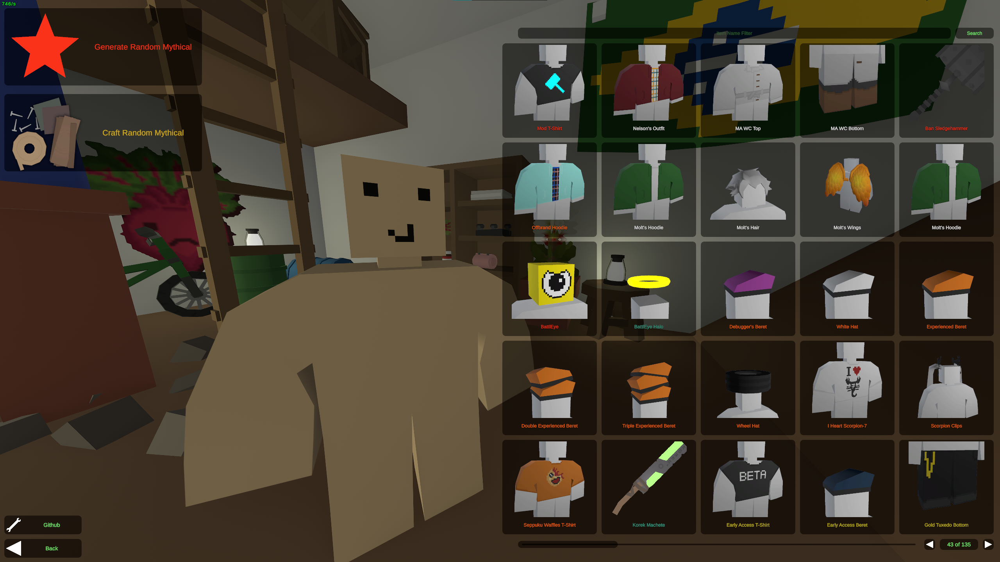
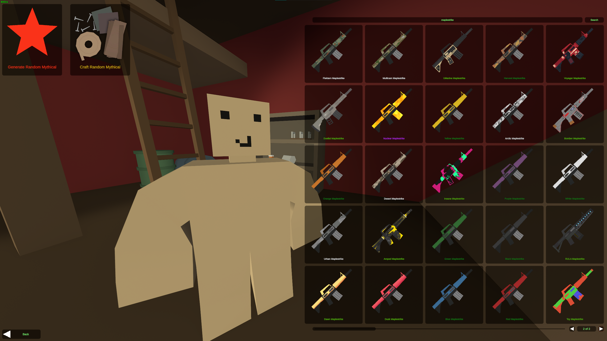
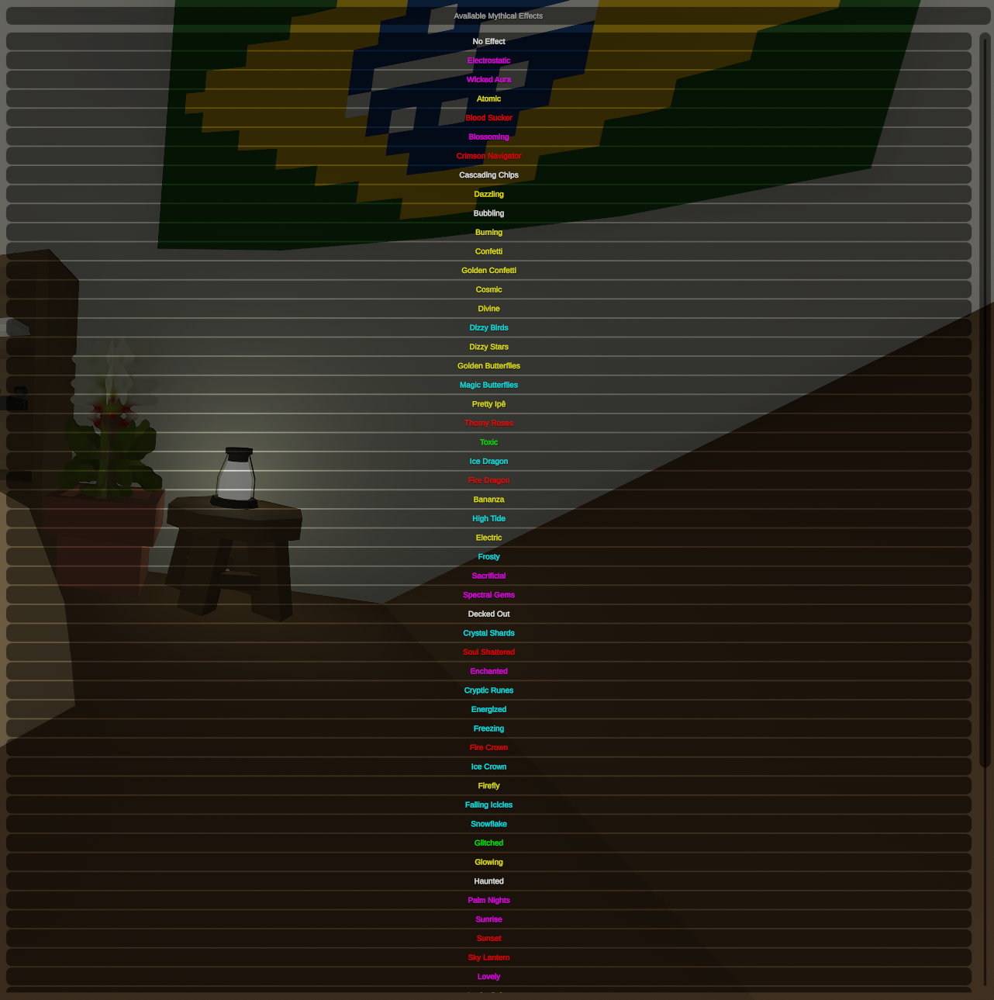
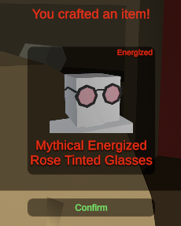
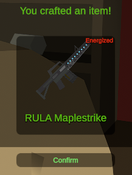
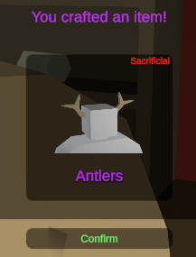
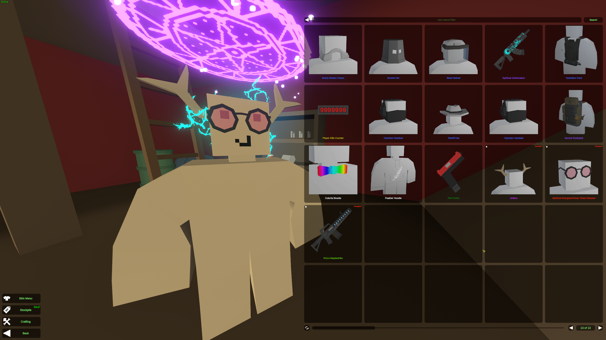
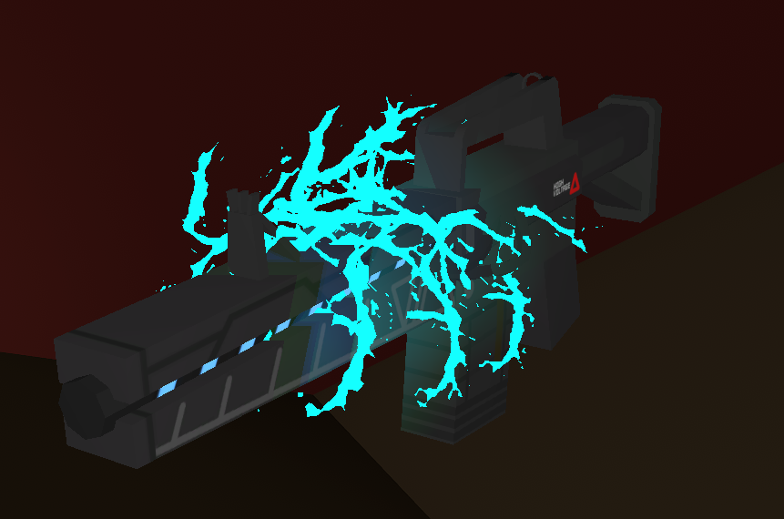
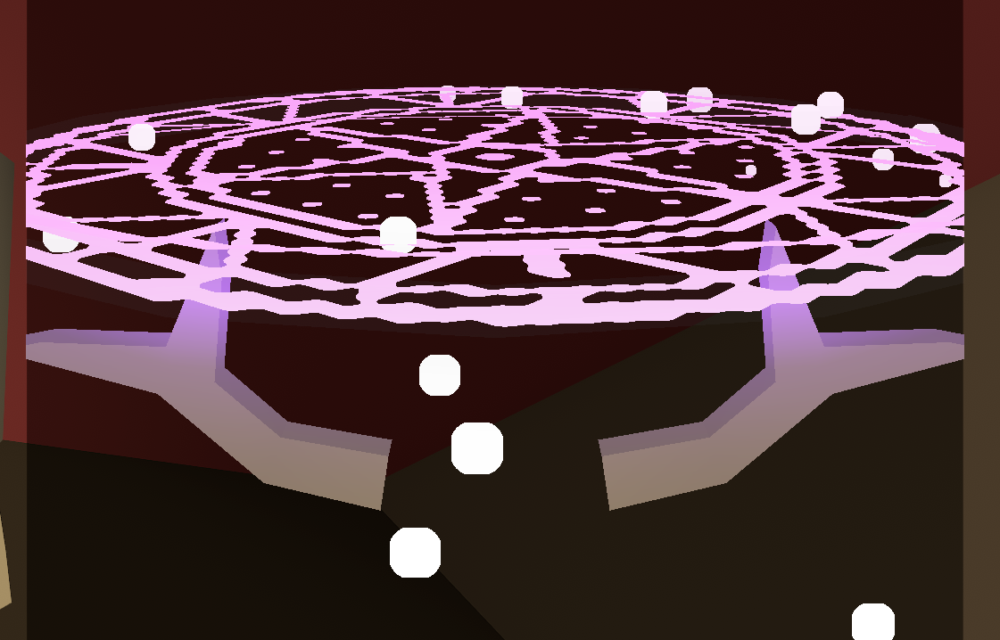
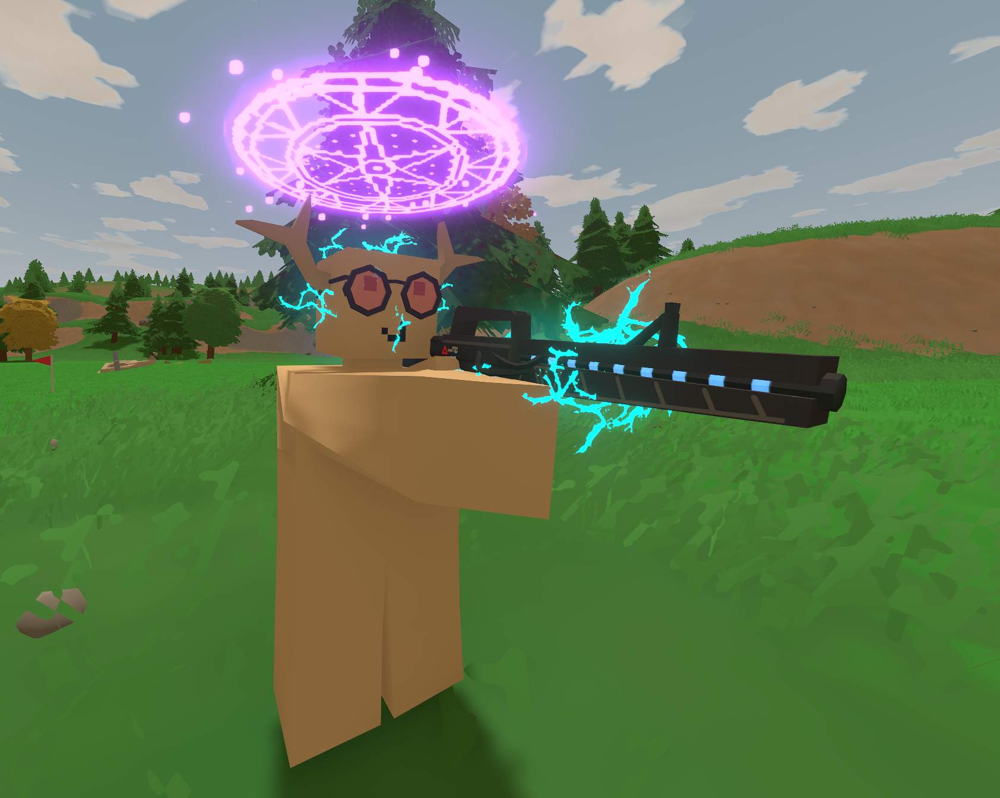

<h1 align="center">Unturned Skins Mod</h1>

<h6 align="center"><em>Unturned patch which provides extensive skin utilities</em></h6>

## Overview

The "mod" (more of a game patch) provides you with extensive skin utilities for [Unturned](https://store.steampowered.com/app/304930/Unturned/), which allow you to create any skin combination of your choice, simulate skin crafting, view and use the generated skins in-game through an integrated skin menu UI within the game, designed to look like a vanilla game UI. It also supports the original box opening and crafting menus, removing country restrictions which would normally prevent you from doing so.

#### Quick links:

- [Installation](#-installation)
- [Usage](#-usage)
- [Showcase](#-showcase)

## Installation

Download a precompiled version here:

| Download | Release | Working | Notes |
|:---------|:--------|:--------|:------|
| [SkinsMod.zip](https://github.com/Arty3/Unturned-Skins-Mod/releases/download/v1.0/SkinsMod.zip) | 1.0 | Buggy | Initial Release |
| [SkinsMod.zip](https://github.com/Arty3/Unturned-Skins-Mod/releases/download/v1.1/SkinsMod.zip) | 1.1 | Buggy | Added Rio Assets |
| [SkinsMod.zip](https://github.com/Arty3/Unturned-Skins-Mod/releases/download/v1.2/SkinsMod.zip) | 1.2 | Missing Assets | Fixed Issues |
| [SkinsMod.zip](https://github.com/Arty3/Unturned-Skins-Mod/releases/download/v1.3/SkinsMod.zip) | 1.3 | Missing Assets | Added Limestone Assets |
| [SkinsMod.zip](https://github.com/Arty3/Unturned-Skins-Mod/releases/download/v1.4/SkinsMod.zip) | 1.4 | Yes | Added California 2 Assets |

## Usage

- Unzip [SkinsMod.zip](https://github.com/Arty3/Unturned-Skins-Mod/releases/download/v1.4/SkinsMod.zip)
- Execute `SkinsMod.exe` as administrator

#### In your inventory, look for:

| Skin Menu Button |
|:----------------:|
||

###### _(Don't close the console window that pops up until after Unturned has finished running)_

## Showcase

| Skin Menu |
|:---------:|
||

| Searching For Skins |
|:-------------------:|
||

| Selecting an Effect |
|:-------------------:|
||

| Generating Mythicals | Generating Item Crafts | Generating Cosmetic Crafts |
|:--------------------:|:----------------------:|:---------------------------:|
|||

| Generated Skins Stay In Your Inventory |
|:--------------------------------------:|
||

| Inspect Skin Crafts | Inspect Cosmetic Crafts |
|:-------------------:|:-----------------------:|
|||

| Use Generated Skins In-Game |
|:---------------------------:|
||

## Features

- Vanilla style UI
- Detailed logging
- Custom skin generation
- Infinite skin generation
- Generate cosmetic particle crafts
- Generate any skin-effect combination
- Not bannable (Battleye isn't running)
- Interactive and responsive UI
- Fast and simple searching mechanism
- Ability to use generated skins in-game
- Random Mythical Generation
- Infinite and free particle crafting
- Removes skin country restrictions
- Vanilla box opening and crafting is still available

## Known Issues

- Cosmetic particle effect tags are all the same (doesn't affect skin iteself)
- Head only effects wont work on non head items (e.g. Sacrificial on a gun)
- Mod will generate particle craft over mythical variant (e.g. Energized Hypertech Maplestrike will be particle effect instead of Mythical). Doesn't affect actual skin appearance

## License
This project uses the `MIT LICENSE` license
 
For more info, please find the `LICENSE` file here: [License](LICENSE)
