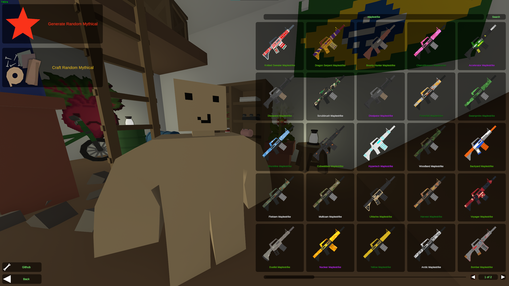
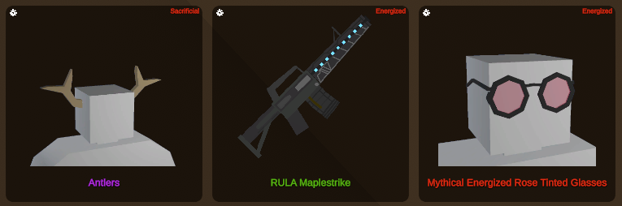

<h1 align="center">✨ Unturned Skins Mod ✨</h1>

<h6 align="center"><em>Unturned patch which provides extensive skin utilities</em></h6>

## 📝 Overview

The "mod" (more of a game patch) provides you with extensive skin utilities for [Unturned](https://store.steampowered.com/app/304930/Unturned/), which allow you to create any skin combination of your choice, simulate skin crafting, view and use the generated skins in-game through an integrated skin menu UI within the game, designed to look like a vanilla game UI. It also supports the original box opening and crafting menus, removing country restrictions which would normally prevent you from doing so.

#### Quick links:

- [Installation](#-installation)
- [Usage](#-usage)
- [Showcase](#-showcase)

## ✨ Features

- Vanilla style UI
- Detailed logging
- Custom skin generation
- Infinite skin generation
- Generate cosmetic particle crafts
- Generate any skin-effect combination
- Not bannable (Battleye isn't running)
- Interactive and responsive UI
- Fast and simple searching mechanism
- Ability to use generated skins in-game
- Random Mythical Generation
- Infinite and free particle crafting
- Removes skin country restrictions
- Vanilla box opening and crafting is still available

## 🚀 Installation

Download a precompiled version here:

| Download | Release | Working | Notes |
|:---------|:--------|:--------|:------|
| [SkinsMod.zip](https://github.com/DontCallMeLuca/Unturned-Skins-Mod/releases/download/v1.0/SkinsMod.zip)| 1.0 | Buggy | Initial Release |
| [SkinsMod.zip](https://github.com/DontCallMeLuca/Unturned-Skins-Mod/releases/download/v1.1/SkinsMod.zip)| 1.1 | Buggy | Added Rio Assets |
| [SkinsMod.zip](https://github.com/DontCallMeLuca/Unturned-Skins-Mod/releases/download/v1.2/SkinsMod.zip)| 1.2 | Yes | Fixed Bugs |

## 💻 Usage

- Unzip [SkinsMod.zip](https://github.com/DontCallMeLuca/Unturned-Skins-Mod/releases/download/v1.0/SkinsMod.zip)
- Execute `SkinsMod.exe` as administrator

#### In your inventory, look for:

| Skin Menu Button |
|:----------------:|
||

###### _(Don't close the console window that pops up until after Unturned has finished running)_

## 🌌 Showcase

| Skin Menu |
|:---------:|
||

| Searching For Skins |
|:-------------------:|
||

| Selecting an Effect |
|:-------------------:|
||

| Generating Mythicals | Generating Item Crafts | Generating Cosmetic Crafts |
|:--------------------:|:----------------------:|:---------------------------:|
|||

| Generated Skins Stay In Your Inventory |
|:--------------------------------------:|
||

| Inspect Skin Crafts | Inspect Cosmetic Crafts |
|:-------------------:|:-----------------------:|
|||

| Use Generated Skins In-Game |
|:---------------------------:|
||

## ⚠ Known Issues

- Cosmetic particle effect tags are all the same (doesn't affect skin iteself)
- Head only effects wont work on non head items (e.g. Sacrificial on a gun)

###### Note that this is still very much a work in progress!

## 💡 Feedback

If you have any feedback, including suggestions, bug reports, or potential vulnerabilities, please don't hesitate to submit them in the [issues](https://github.com/DontCallMeLuca/Unturned-Skins-Mod/issues) section. If applicable, kindly provide detailed descriptions and replication steps to help me address them effectively.

#### Alternatively, find me here:

| Discord | Steam |
|:-------:|:-----:|
|  | |

## 🛠 Technical Disclaimers

This project was made with Windows in mind. It won't support MacOS or Linux systems.

Because Nelson keeps the skin generation logic on the server side (for obvious reasons), this project isn't very maintainable due to a large number of hardcoded things which are simply not dynamically resolvable on the client side at runtime. Therefore, for future updates, additional effects will need to be hardcoded.

Nelson does put effort into server sided backwards compatibility, however, not on the client side. Therefore it could be that an update breaks things by changing client side logic.

I've added several checks for this within the code, if you find one, please feel free to report it.

Box opening simulations aren't included, since it would require a significant amount of hardcoding valid effects for each box (e.g. Divine not being available anymore).

The code isn't very maintainable and / or scalable. It is currently a very early version, and I didn't include much effort into making the code scalable / maintainable. The goal was more to get a working product. I won't set up collaboration support, however, if you do so decide to improve the project please let me know (See [contacting me](#alternatively-find-me-here)) and I'll be sure to review it and credit you!

## ⭐ Future Improvements

- Fix known issues
- Allow effects of any kind on any item
- Allow for multiple effects on 1 item
- Update effects UI to be cleaner
- Possible server compatibility

## 📃 License
This project uses the `GNU GENERAL PUBLIC LICENSE v3.0` license
 
For more info, please find the `LICENSE` file here: [License](LICENSE)
